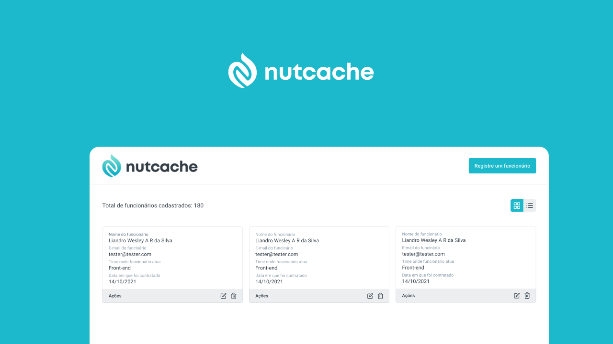

<h1 align="center">
    
</h1>

<p align="center">
  <a href="#technologies">Technologies</a>&nbsp;&nbsp;&nbsp;|&nbsp;&nbsp;&nbsp;
  <a href="#-layout">Getting started</a>&nbsp;&nbsp;&nbsp;|&nbsp;&nbsp;&nbsp;
  <a href="#-project">Project</a>&nbsp;&nbsp;&nbsp;|&nbsp;&nbsp;&nbsp;
  <a href="#-layout">Layout</a>&nbsp;&nbsp;&nbsp;|&nbsp;&nbsp;&nbsp;
  <a href="#-license">License</a>
</p>

<br>

<p align="center">
  
</p>

---

## 🧪 Technologies

This project was developed using the following technologies and tools:

- [React JS](https://reactjs.org/)
- [Styled Components](https://styled-components.com/)
- [TypeScript](https://www.typescriptlang.org/)
- [Jest](https://jestjs.io/pt-BR/)
- [React Testing Library](https://testing-library.com/docs/react-testing-library/intro/)

## 🚀 Getting started

Clone the project and access the folder

```bash
$ git clone https://github.com/liandro-wesley/nutcache-challenge-LiandroSilva.git && cd nutcache-challenge-LiandroSilva
```

Follow the steps below
```bash
# Install the dependencies
$ yarn or npm install

# Start the project
$ yarn start or npm run start
```
## 💻 Project

Application created to facilitate the management of Nutcache Brasil employees.

Submitted as part of the assessment for Front-End Software Engineer.

[Online Demo](https://nutcachebrazil.liandrowesley.dev)

## 🔖 Layout

You can view the project layout through the link below:

- [Layout](https://www.figma.com/file/p3w9suQv56TwWidVW1b86m/NutCacheBrazilFrontend?node-id=1%3A2) 

Remembering that you need to have a [Figma](http://figma.com/) account to access it.

## 📝 License

This project is licensed under the MIT License. See the [LICENSE](LICENSE.md) file for details.


---

Made with 💙 by [Liandro Wesley](https://www.liandrowesley.dev) 👋